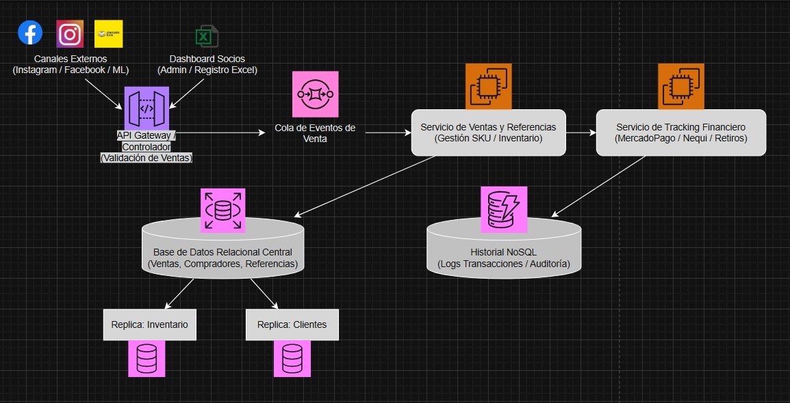

# 📄 Informe Técnico del Taller

## 🔖 Nombre del Taller
_Taller 4: Mapa de Infraestructura y Diagnóstico Técnico_

## 👥 Integrantes del equipo
- Julián Mauricio Zafra (julianzamo@unisabana.edu.co)
- Santiago Araque (santiagoaral@unisabana.edu.co)
- Juan José Forero (juanfope@unisabana.edu.co)

## 🧠 Descripción general del trabajo
En el presente trabajo se llevó a cabo la elaboración del mapa de infraestructura del sistema real del cliente, enfocado en las operaciones de THEGEEKHUB. El objetivo principal de este taller fue realizar un diagnóstico técnico exhaustivo para identificar debilidades o cuellos de botella reales o potenciales en su flujo de trabajo actual. La actividad se desarrolló analizando la transición de un negocio manejado a través de redes sociales y hojas de Excel hacia un modelo más limpio y estructurado que garantice la consistencia en los datos. Finalmente, este modelado se complementó con la redacción de un informe técnico y una investigación sobre buenas prácticas de arquitectura de infraestructura (cloud, on-premise, híbrida) para proponer soluciones viables a largo plazo.

## 🔧 Proceso de desarrollo
Nuestro proceso de desarrollo se realizó de manera progresiva, tomando como base el modelo entidad-relación construido en etapas anteriores y las necesidades de expansión del negocio. Las decisiones arquitectónicas se ajustaron de la siguiente manera:
- Integración de canales y validación: Lo primero que modelamos fueron los puntos de entrada del sistema. Se definió un API Gateway / Controlador encargado de centralizar y validar las ventas provenientes de los canales externos (Instagram, Facebook, Mercado Libre) y del Dashboard de socios donde actualmente manejan el registro en Excel.
- Gestión de tráfico y asincronismo: Para evitar cuellos de botella durante picos de transacciones, tomamos la decisión de implementar una "Cola de Eventos de Venta". Esta herramienta actúa como un amortiguador que recibe las peticiones validadas y las distribuye de forma asíncrona hacia los servicios internos.
- Estructuración de microservicios: Separamos la lógica del negocio en dos componentes clave. Por un lado, el "Servicio de Ventas y Referencias" para otorgarle de forma estándar un SKU a cada producto y gestionar el inventario. Por otro lado, un "Servicio de Tracking Financiero" dedicado exclusivamente a la integración con pasarelas de pago (MercadoPago, Nequi) y el manejo de retiros.
- Estrategia de persistencia de datos: Para el almacenamiento, decidimos dividir la responsabilidad. Implementamos una Base de Datos Relacional Central orientada a garantizar la consistencia de las entidades fundamentales (Ventas, Compradores, Referencias), complementada con réplicas de lectura para Inventario y Clientes.
- Auditoría y trazabilidad: Como ajuste final para asegurar un registro adecuado de la información financiera, se incluyó una base de datos NoSQL. Esta herramienta se utiliza para guardar el historial, los logs de transacciones y facilitar auditorías, garantizando que el sistema sea más profesional y seguro de cara al futuro.

## 🧩 Análisis del modelo propuesto

El cliente necesitaba una migracion limpia a un modelo que descontinuara el uso constante de hojas de calculo para el registro de datos de ventas y clientes, para ello lo principal era usar una herramienta mejor estructurada, que en este caso mayormente es usando los servicios de AWS en nuestra propuesta para THEGEEKHUB, tomar las hojas de calculo ya existentes y clasificar sus datos en las bases de datos relacionales y no relacionales. Para esta tarea se representa en el diagrama un API gateway que comunica los datos de las hojas de calculo y las futuras ventas por redes sociales. El API Gateway actua como un intermediario con los servicios de ventas y referencias. Posteriormente este servicio da paso al de tracking financiero que esta vinculado a una base de datos no relacional, por otro lado la base de datos relacional de los servicios de ventas se encargan de alamacenar la informacion de clientes e inventario.

Ajustando el modelo al propuesto garantiza llevar un mejor control de las ventas y que los datos que guarden una relacion directa entre si se vinculen de forma adecuada, de igual manera y aunque nuestra sugerencia es el uso de la cloud de AWS el cliente podria pedir que esta misma estructura se ajuste bien sea a otro servicio cloud o algun servicio on premise como puede ser el uso de mongodb para las bases de datos no relacionales, dado que estas solo se encargan de guardar logs e historicos que sirven para analisis de ventas y realizar auditorias.

Como supuestos para el modelo se tomo que se requerira de una escalabilidad Vertical dado que el sistema asume que el volumen de transacciones crecerá, por lo que se incluyen réplicas de lectura para no saturar la base de datos principal durante consultas de inventario. Tambien la inclusion de seguridad por capas dado que usar un Gateway, se asume que las credenciales de las APIs externas (MercadoPago) están protegidas y no expuestas directamente al cliente final.

## 📈 Diagrama final entregado

## 📋 Tabla de actores, entidades o componentes (si aplica)

| Nombre del elemento | Tipo | Descripción |
|---------------------|------|-------------|
| API Gateway         | Componente | Punto de entrada que autentica y enruta las peticiones de ventas y socios.       |
| Messaging Queue           | Infraestructura | Cola que organiza las órdenes de compra para ser procesadas sin pérdida de datos.            |
| Relational DB         | Persistencia | Base de datos principal que asegura la consistencia de Ventas y Compradores.      |
| NoSQL DB         | Persistencia | Almacenamiento de alta velocidad para auditoría y logs de transacciones financieras. | 
| Read Replicas        | Desempeño | Copias de la base de datos para agilizar la consulta de precios y stock por parte de los socios.         |

## 🔍 Investigación complementaria
### Tema investigado:
Tema investigado: Persistencia Políglota en Arquitecturas de Microservicios

### Resumen:
En el desarrollo de sistemas modernos, el concepto de Persistencia Políglota [1] se refiere a la práctica de utilizar diferentes tecnologías de bases de datos para resolver distintos problemas de almacenamiento dentro de una misma aplicación. Para THEGEEKHUB, esta investigación justifica la coexistencia de:

Bases de Datos Relacionales (SQL): Ideales para el modelo de entidades donde las relaciones (Comprador-Venta-Referencia) deben cumplir con las propiedades ACID (Atomicidad, Consistencia, Aislamiento y Durabilidad). Esto garantiza que no se venda un producto sin stock.

Bases de Datos No Relacionales (NoSQL): Según autores como Martin Fowler, estas son esenciales para manejar datos "ruidosos" o semi-estructurados. En este proyecto, se aplican para registrar los estados de las transferencias entre Nequi y MercadoPago, donde la velocidad de escritura es prioritaria sobre la complejidad de las relaciones.

Esta estrategia no solo mejora el rendimiento, sino que prepara a THEGEEKHUB para una futura migración a la nube (AWS o Azure), donde este tipo de arquitecturas son el estándar de la industria.

## 📚 Referencias
NGINX. (s.f.). What is an API Gateway?. NGINX Documentation. https://www.nginx.com/resources/glossary/api-gateway/
Oracle. (s.f.). SQL vs. NoSQL: What’s the Difference?. Oracle Resources. https://www.oracle.com/database/technologies/nosql-databases.html
Fowler, M. (2011, 16 de noviembre). Polyglot Persistence. MartinFowler.com. https://martinfowler.com/bliki/PolyglotPersistence.html
---

_Este documento hace parte de la entrega del taller X del curso AREM (Arquitectura Empresarial) - Universidad de La Sabana._
